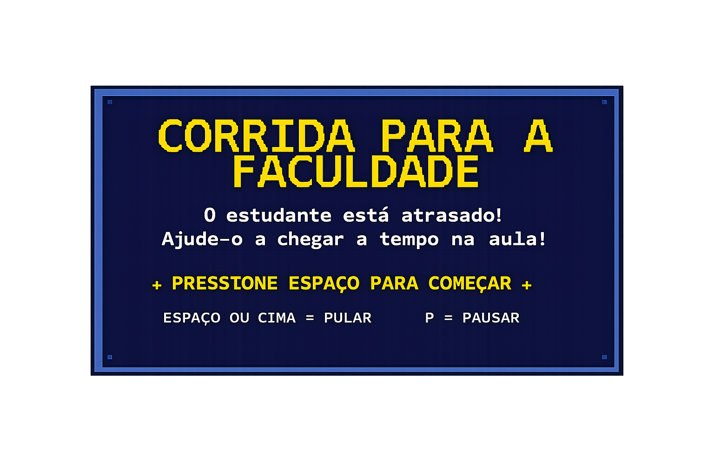

# Corrida para a Faculdade

A 2D endless-runner built with Python and Pygame. A student is late for class and has
to dodge city obstacles to arrive on time. Reaching 1000 points means passing;
losing all 3 lives means failing.

Academic project focused on game logic and state-driven programming.

## Screens

| Start | Win | Lose |
|---|---|---|
|  |  |  |

## Features

- Clear state machine: menu -> game -> end (win or lose) -> menu
- Jump physics with gravity and jump force
- Random obstacles (cone, bin, clock, goalpost) with a spawn interval that shrinks as the score grows
- Progressive difficulty: speed increases every 100 points, up to a cap
- 3 lives with temporary invincibility and a blink effect after a collision
- HUD with a progress bar to the goal, score, high score and lives
- Persistent high score stored in `recorde.txt` (kept out of version control)
- Continuously scrolling background, shadows, and custom menu/pause/end screens
- Fallback: if an image file is missing, the game keeps running with simple shapes

## Controls

| Key | Action |
|---|---|
| `Space` or `Up` | Jump |
| `P` | Pause / resume |
| `Esc` | Back to menu |

## Tech

- Python 3
- Pygame

## Structure

```
.
├── main.py              # full game: states, physics, collision and rendering
└── imagens/
    ├── background.png   # scenery
    ├── source.png       # player sprite
    └── obstaculos/      # obstacles + interface screens (start, pause, win, lose)
```

## Running

```bash
pip install pygame
python main.py
```

The game opens in full screen (`pygame.FULLSCREEN | pygame.SCALED`). Press `Esc` to
return to the menu and close the window to quit.

## Authorship

Game code written by Giovanna Ribas dos Reis - individual academic project.

## Transparency

- The game code (`main.py`) is my own work, not AI-generated.
- The visual assets in `imagens/` (scenery, sprite and interface screens) are AI-generated.
